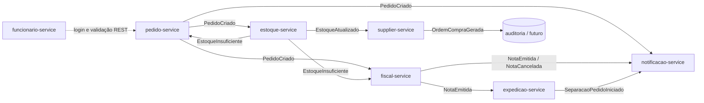

## PROJETO SAGA AWS

Backend de portfólio que simula o atendimento de um supermercado com sete microsserviços independentes, banco por serviço e uma SAGA por coreografia. Não existe frontend nem um orquestrador central: os serviços reagem aos eventos do seu próprio domínio usando SNS/SQS compatíveis com AWS, executados localmente pelo Floci.

## Por que este projeto existe

A primeira modelagem era uma cadeia HTTP síncrona. Ela apresentava três problemas de negócio e operação:

- acoplamento temporal: cada serviço esperava a resposta do anterior;
- falha em cascata: a indisponibilidade de uma etapa interrompia toda a venda;
- escala explosiva: em picos como Black Friday, escalar horizontalmente apenas adiava o colapso da cadeia.

A solução adotada foi uma arquitetura orientada a eventos com SAGA por coreografia. Quando o pagamento é confirmado, estoque, fiscal e notificações recebem `PedidoCriado` em paralelo. Cada consumidor persiste sua própria decisão e pode continuar ou compensar o fluxo sem uma chamada REST entre os serviços da venda.

## Arquitetura



`expedicao-service` começa a separação somente após `NotaEmitida`. `funcionario-service` é propositalmente síncrono e não publica nem consome eventos; autenticação de operador é request/response, não uma etapa da saga.

### Garantias de consistência

- Cada serviço possui seu próprio PostgreSQL e suas migrations Flyway.
- Eventos usam o envelope `eventId`, `eventType`, `sagaId`, `correlationId`, `timestamp`, `version` e `payload`.
- Consumidores registram `eventId` em `eventos_processados` na mesma transação da regra de negócio.
- Serviços que emitem eventos gravam primeiro em `outbox_events` com propagação transacional `MANDATORY`.
- Um poller separado publica pendências no SNS com o atributo `eventType`; falhas permanecem no outbox para retry.
- Filas SQS possuem DLQ e só são excluídas após processamento bem-sucedido.
- O estoque ordena locks pessimistas múltiplos e desfaz reservas parciais antes de emitir compensação.
- O fiscal tolera `PedidoCriado` e `EstoqueInsuficiente` fora de ordem por meio de `pedidos_cancelados`.

## Catálogo de eventos

| Evento | Publicado por | Consumido por |
|---|---|---|
| `PedidoCriado` | pedido-service | estoque-service, fiscal-service, notificacao-service |
| `EstoqueAtualizado` | estoque-service | supplier-service |
| `EstoqueInsuficiente` | estoque-service | pedido-service, fiscal-service |
| `NotaEmitida` | fiscal-service | expedicao-service, notificacao-service |
| `NotaCancelada` | fiscal-service | notificacao-service |
| `SeparacaoPedidoIniciado` | expedicao-service | notificacao-service |
| `OrdemCompraGerada` | supplier-service | auditoria/futuro |

## Serviços

| Serviço | Porta | Banco | Responsabilidade e endpoints principais |
|---|---:|---|---|
| pedido-service | 8081 | `pedido_db` | cria pedidos, confirma pagamento, compensa falta de estoque; `POST /pedidos`, `POST /pedidos/{id}/confirmar-pagamento`, `GET /pedidos/{id}` |
| estoque-service | 8082 | `estoque_db` | produtos, saldo e reservas; `POST /produtos`, `GET /produtos`, `POST /produtos/{id}/estoque-ajustes` |
| fiscal-service | 8083 | `fiscal_db` | emite e cancela notas; `GET /notas-fiscais`, `GET /notas-fiscais/{pedidoId}` |
| notificacao-service | 8084 | `notificacao_db` | histórico terminal de notificações; `GET /notificacoes/{pedidoId}` |
| expedicao-service | 8085 | `expedicao_db` | inicia separação após nota emitida; `GET /separacoes/{pedidoId}` |
| funcionario-service | 8086 | `funcionario_db` | login e validação de sessão; `POST /auth/login`, `GET /auth/validar` |
| supplier-service | 8087 | `fornecedores_db` | cadastro de fornecedores e ordem por estoque baixo; CRUD em `/fornecedores` |

## Infraestrutura local

O `docker-compose.yml` sobe:

- Floci `1.5.11-compat` na porta 4566;
- um PostgreSQL 16 isolado para cada microsserviço;
- os sete serviços Java em imagens multi-stage (Maven no build e JRE 21 Alpine no runtime);
- volumes persistentes, rede interna e health checks dos bancos/Floci.

O script `infra/floci/init-aws.sh` cria `saga-events-topic`, uma fila e uma DLQ por consumidor e as subscriptions com filtro por `eventType`. `funcionario-service` não recebe fila. O `inventory-service` em inglês é legado, está fora do Compose e não participa da arquitetura final; sua remoção do repositório depende de confirmação explícita do proprietário.

### Subir tudo

Pré-requisitos: Docker com Compose v2. Nenhum token do LocalStack é necessário.

```bash
docker compose up --build
```

Para acompanhar apenas os serviços de aplicação:

```bash
docker compose logs -f pedido-service estoque-service fiscal-service notificacao-service expedicao-service funcionario-service supplier-service
```

Para encerrar preservando os volumes:

```bash
docker compose down
```

Use `docker compose down -v` somente quando quiser apagar deliberadamente os bancos e o estado local do Floci.

## Contrato de autenticação do caixa

O funcionário é cadastrado administrativamente no banco/API e deve estar ativo, com cargo permitido, para abrir uma sessão.

```http
POST /auth/login
Content-Type: application/json

{
  "matricula": "CX-1001",
  "senha": "segredo"
}
```

Resposta autorizada:

```json
{
  "token": "token-opaco-gerado-pelo-servidor",
  "expiraEm": "2026-07-28T22:00:00Z"
}
```

Validação consumível futuramente pelo `ValidadorSessaoCaixa` real do pedido:

```http
GET /auth/validar?token=token-opaco-gerado-pelo-servidor
```

```json
{
  "valido": true,
  "funcionarioId": "4d5d0e67-536e-4a23-bccb-757e4c5fef30",
  "expiraEm": "2026-07-28T22:00:00Z"
}
```

## Testes

Cada módulo possui testes JUnit 5 e um `src/test/resources/application-test.yml` com H2, Flyway desabilitado e `ddl-auto: create-drop`. As migrations PostgreSQL continuam obrigatórias no perfil normal.

**Rodada final:** 40 testes executados, 40 aprovados, 0 falhas, 0 erros e 0 ignorados.

PowerShell:

```powershell
$services = 'pedido-service','estoque-service','fiscal-service','notificacao-service','expedicao-service','funcionario-service','supplier-service'
foreach ($service in $services) {
  Push-Location "services/$service"
  mvn test
  Pop-Location
}
```

Bash:

```bash
for service in pedido estoque fiscal notificacao expedicao funcionario supplier; do
  (cd "services/${service}-service" && mvn test)
done
```

Os testes cobrem estado final, idempotência, conteúdo do outbox, publicação única, compensações fora de ordem e a regra de que expedição nunca consome `PedidoCriado`.

## Stack

Java 21, Spring Boot 3.3.2, Spring Data JPA, PostgreSQL 16, Flyway, AWS SDK v2 para SNS/SQS, Floci, springdoc-openapi, JUnit 5, Mockito, AssertJ, H2 e Docker Compose.
